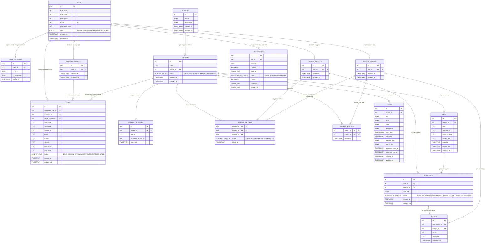

### Описание связей

| Связь                           | Тип | Описание                                                                                           |
| ------------------------------- | --- | -------------------------------------------------------------------------------------------------- |
| USER → USER_TELEGRAM            | 1:1 | У пользователя может быть привязан один Telegram-аккаунт                                           |
| USER → MENTOR_PROFILE           | 1:1 | У пользователя может быть один профиль ментора                                                     |
| USER → STUDENT_PROFILE          | 1:1 | У пользователя может быть один профиль студента                                                    |
| USER → MANAGER_PROFILE          | 1:1 | У пользователя может быть один профиль менеджера                                                   |
| USER → NOTIFICATION             | 1:N | У пользователя может быть много уведомлений                                                        |
| USER → LEAD                     | 1:1 | Лид конвертируется в пользователя при зачислении (`converted_user_id`)                             |
| MANAGER_PROFILE → LEAD          | 1:N | Один менеджер ведёт много заявок                                                                   |
| COURSE → STREAM                 | 1:N | Один курс реализуется в нескольких потоках                                                         |
| STREAM → STREAM_TELEGRAM        | 1:1 | К потоку привязан один Telegram-чат (для анонсов лекций)                                           |
| STREAM → LEAD                   | 1:N | Один поток принимает много заявок                                                                  |
| STREAM → TASK                   | 1:N | Один поток содержит много заданий                                                                  |
| STREAM → LESSON                 | 1:N | Один поток содержит много занятий                                                                  |
| STUDENT_PROFILE ↔ STREAM        | M:N | Через `STREAM_STUDENT`: студент может учиться в нескольких потоках, поток содержит много студентов |
| MENTOR_PROFILE ↔ STREAM         | M:N | Через `STREAM_MENTOR`: ментор ведёт несколько потоков, поток содержит несколько менторов           |
| MENTOR_PROFILE → STREAM_STUDENT | 1:N | Ментор закреплён за конкретными студентами внутри потока                                           |
| TASK → SUBMISSION               | 1:N | По одному заданию может быть много сдач (от разных студентов)                                      |
| STUDENT_PROFILE → SUBMISSION    | 1:N | Студент может сдавать много заданий                                                                |
| SUBMISSION → REVIEW             | 1:N | Одна сдача может иметь несколько ревью (первичное + доработки)                                     |
| MENTOR_PROFILE → REVIEW         | 1:N | Ментор делает много ревью                                                                          |

### Ответы на вопросы

1. Чем связь 1:N отличается от M:N? Приведите пример каждой из вашего проекта.

_Ответ:_
1:N — один родитель, много дочерних записей, но не наоборот. Например, один `STREAM` содержит много `TASK`, но каждое задание принадлежит строго одному потоку.
M:N — оба объекта могут иметь много связей с другой стороны. Например, `STUDENT_PROFILE` и `STREAM`: студент может учиться в нескольких потоках, и в каждом потоке много студентов. Реализовано через промежуточную таблицу `STREAM_STUDENT`.

2. Почему связь M:N нельзя реализовать двумя таблицами? Зачем нужна промежуточная?

_Ответ:_
Нет способа хранить `список` в одной колонке без нарушения реляционной модели.
Если добавить в `STUDENT_PROFILE` колонку `stream_ids`, туда бы пришлось писать что-то вроде "1,2,3" — это не атомарное значение, нельзя сделать JOIN, индексировать или проверять целостность через FK.
Промежуточная таблица `STREAM_STUDENT` решает это элегантно: каждая строка — одна пара (stream_id, student_id). Плюс в неё можно добавить дополнительные данные о связи: `mentor_id`, `status`, `joined_at`.

3. Что будет, если удалить запись, на которую ссылается FK?

_Ответ:_
Зависит от настройки FK:

- `CASCADE` — зависимые строки удалятся автоматически. Например, при удалении `STREAM` удалятся все `TASK`, `LESSON`, `STREAM_STUDENT` этого потока.
- `RESTRICT` — БД вернёт ошибку и отменит операцию. Например, нельзя удалить `COURSE`, если к нему привязан хотя бы один `STREAM`.
- `SET NULL` — FK в зависимой строке станет NULL. Например, при удалении менеджера его `manager_id` в `LEAD` обнулится, заявка сохранится без ответственного.

4. Может ли FK быть NULL? Когда это полезно?

_Ответ:_
Да. Например, в таблице `LEAD`: когда заявка только поступает в CRM, у неё ещё нет ответственного менеджера — `manager_id` будет NULL. Как только менеджер берёт заявку в работу, туда записывается его ID. Аналогично `converted_user_id` — NULL до момента зачисления студента.
